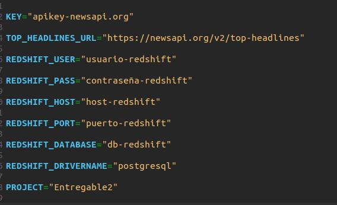

# Primer Entregable

Actualización:
Aplicado los cambios de la devolución:

- Agregado distkey en la codigo de la tabla.
- Refactorizado logica de transformanciones y limpieza del dataframe.

Se uso la api newsapi.org como requerimiento para desarrollo del entregable. 
A continuacion esta el enlace de la pagina:

https://newsapi.org/

Se decidio usar el endpoint "Top headlines".

Una vez clonado el repositorio, se debe tener en cuenta lo siguiente:

* Crear un archivo ".env":
  
  Dicho archivo contiene las variables de entorno necesarias para el funcionamento del entregable. 
  El Archivo ".env_template", es una plantilla de como deberia estar formado el archivo .env.
  Es posible modificarlo, sustituir los valores correspondiente de cada variable y cambiarle el nombre a ".env".
  
  
  
  

