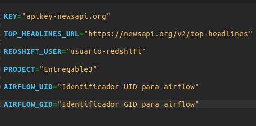

# Tercer Entregable

# Actualización:
Se Aplicaron los cambios de la devolución:

-Se modifico la logica de los task para guardar la informacion procesaba en archivos en formato json y csv.

- Se Refactorizaron los task para pasar la ruta y el nombre del archivo con la informacion de los articulos.

- Se creo una nueva task para limpiar el directorio de los archivos posteriormente procedados para un mejor uso de la memoria.


Se uso la api newsapi.org como requerimiento para desarrollo del entregable. 
A continuacion esta el enlace de la pagina:

https://newsapi.org/

Se decidio usar el endpoint "Top headlines".

Una vez clonado el repositorio, se debe tener en cuenta lo siguiente:

* Crear un archivo ".env":
  
  Dicho archivo contiene las variables de entorno necesarias para el funcionamento del entregable. 
  El Archivo ".env_template", es una plantilla de como deberia estar formado el archivo .env.
  Es posible modificarlo, sustituir los valores correspondiente de cada variable y cambiarle el nombre a ".env".
  
  
  
* Crear las siguientes carpetas a la misma altura del `docker-compose.yaml`.

```bash
mkdir -p dags,logs,plugins,data
```
* Ejecutar el siguiente comando para levantar los servicios de Airflow.

```bash
docker-compose up --build
```
* Una vez que los servicios estén levantados, ingresar a Airflow en `http://localhost:8080/`.

* En la pestaña `Admin -> Connections` crear una nueva conexión con los siguientes datos para Redshift:

    * Conn Id: `redshift_default`
    * Conn Type: `Amazon Redshift`
    * Host: `host de redshift`
    * Database: `base de datos de redshift`
    * Schema: `esquema de redshift`
    * User: `usuario de redshift`
    * Password: `contraseña de redshift`
    * Port: `5439`
  
  


